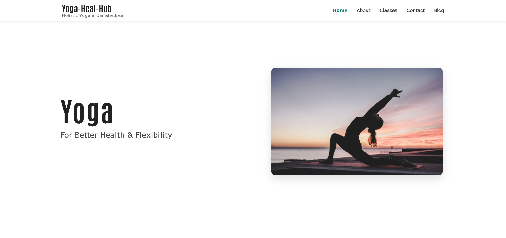
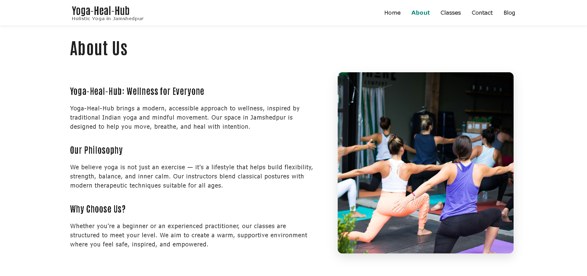
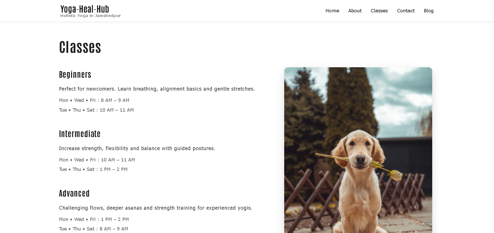
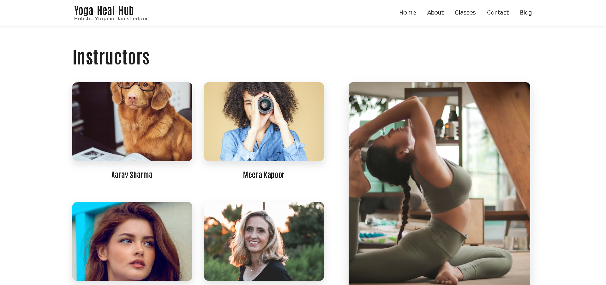
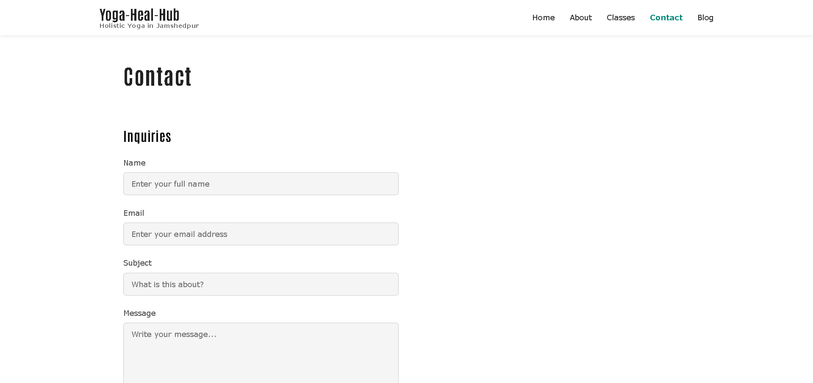
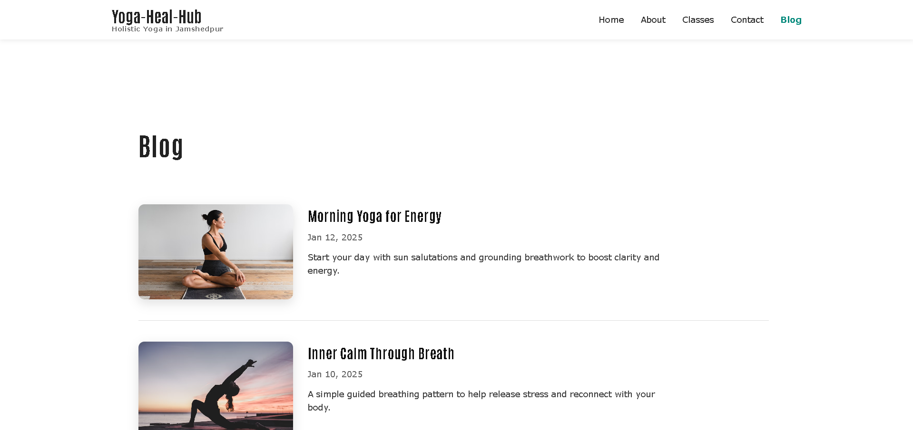

# Yoga-Heal-Hub 🧘‍♀️













Multi-page React website for a small yoga & rehabilitation studio inspired by the outskirts of Jamshedpur.  
It's a modern remake of a classic static HTML template using React, Vite, styled-components, and React Router.

-   Fixed header with navigation
-   Multiple pages: Home, About, Classes, Instructors, Blog, Blog Post, Contact
-   Blog list with clickable cards and slug-based detail pages
-   Simple, mobile-friendly layout built with styled-components

---

## 🔗 Links

-   GitHub: https://github.com/a2rp/yoga-heal-hub
-   Live Demo: https://a2rp.github.io/yoga-heal-hub

(Update these if your repo / live URL is different.)

---

## 🚀 Tech Stack

-   React (Vite)
-   React Router DOM
-   styled-components
-   MUI (for the Suspense loader)
-   React Icons

---

## 🧩 Main Features

-   **Home** – hero “Yoga for Better Health & Flexibility” with supporting image
-   **About** – overview of Yoga-Heal-Hub and its philosophy
-   **Classes** – Beginner / Intermediate / Advanced classes with timings
-   **Instructors** – instructor grid with 4 profiles and a yoga image
-   **Blog** – list of posts with images, dates, and short excerpts
-   **Blog Post** – dynamic route `/blog/:slug` with full article content
-   **Contact** – simple inquiry form (name, email, subject, message)
-   **Header & Footer** – fixed header + footer with Jamshedpur reference and social icons

---

## 🛠️ Getting Started

### 1. Clone the repo

```bash
git clone https://github.com/a2rp/yoga-heal-hub.git
cd yoga-heal-hub
```

## Links

- Portfolio: [https://www.ashishranjan.net](https://www.ashishranjan.net)
- GitHub: [https://github.com/a2rp](https://github.com/a2rp)
- CodePen: [https://codepen.io/ash1198](https://codepen.io/ash1198)
- LinkedIn: [https://www.linkedin.com/in/aashishranjan](https://www.linkedin.com/in/aashishranjan)
- Facebook: [https://www.facebook.com/theash.ashish/](https://www.facebook.com/theash.ashish/)
- YouTube: [https://www.youtube.com/@ashishranjan-ashz?sub_confirmation=1](https://www.youtube.com/@ashishranjan-ashz?sub_confirmation=1)
- Email: [ash.ranjan09@gmail.com](mailto:ash.ranjan09@gmail.com)

## Support

- Support: [https://a2rp-donation-page.netlify.app/](https://a2rp-donation-page.netlify.app/)
- Buy Me A Coffee: [https://buymeacoffee.com/a2rp](https://buymeacoffee.com/a2rp)
- Patreon: [https://patreon.com/a2rp](https://patreon.com/a2rp)
<!-- Project links -->

## Links

- Live: [https://a2rp.github.io/yoga-heal-hub/](https://a2rp.github.io/yoga-heal-hub/)
- Repository: [https://github.com/a2rp/yoga-heal-hub](https://github.com/a2rp/yoga-heal-hub)
- Portfolio: [https://www.ashishranjan.net/](https://www.ashishranjan.net/)
- GitHub: [https://github.com/a2rp](https://github.com/a2rp)
- CodePen: [https://codepen.io/ash1198](https://codepen.io/ash1198)
- LinkedIn: [https://www.linkedin.com/in/aashishranjan](https://www.linkedin.com/in/aashishranjan)
- Facebook: [https://www.facebook.com/theash.ashish/](https://www.facebook.com/theash.ashish/)
- YouTube: [https://www.youtube.com/@ashishranjan-ashz?sub_confirmation=1](https://www.youtube.com/@ashishranjan-ashz?sub_confirmation=1)
- Email: [ash.ranjan09@gmail.com](mailto:ash.ranjan09@gmail.com)

## Support

- Support: [https://a2rp-donation-page.netlify.app/](https://a2rp-donation-page.netlify.app/)
- Buy Me a Coffee: [https://buymeacoffee.com/a2rp](https://buymeacoffee.com/a2rp)
- Patreon: [https://www.patreon.com/a2rp](https://www.patreon.com/a2rp)
