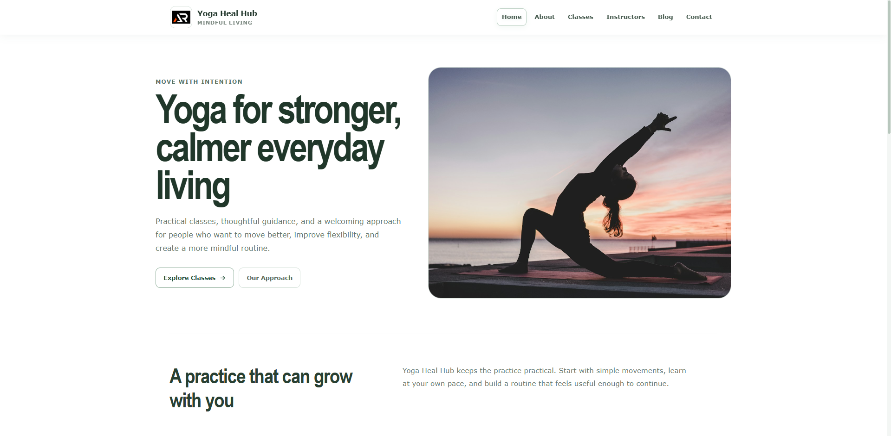

# Yoga Heal Hub

Yoga Heal Hub is a responsive yoga and wellness website built with React and Vite.

It provides a calm and practical space for exploring yoga classes, instructors, mindful movement, flexibility, breathing practices, and everyday wellness guidance.



## Features

- Responsive multi-page interface
- Fixed header with scroll hide and show behavior
- Mobile navigation menu
- Yoga classes for different experience levels
- Instructor profiles
- Wellness blog and individual article pages
- Contact form with email preparation
- Breadcrumb navigation
- Floating back-to-top button
- Local image assets
- Accessible navigation and form controls
- Open Graph and Twitter social preview metadata
- GitHub Pages deployment support

## Pages

- Home
- About
- Classes
- Instructors
- Blog
- Blog Post
- Contact
- Not Found

## Tech Stack

- React
- Vite
- React Router
- styled-components
- React Icons
- JavaScript
- HTML
- CSS

## Project Structure

```text
src
├── components
│   ├── backToTop
│   ├── breadcrumbs
│   ├── footer
│   └── header
├── pages
│   ├── about
│   ├── blog
│   ├── blogPost
│   ├── classes
│   ├── contact
│   ├── home
│   ├── instructors
│   └── notFound
├── utils
│   └── assets.js
├── App.jsx
├── App.styled.js
├── AppRoutes.jsx
├── index.css
└── main.jsx
```

## Getting Started

Clone the repository:

```bash
git clone https://github.com/a2rp/yoga-heal-hub.git
```

Open the project:

```bash
cd yoga-heal-hub
```

Install dependencies:

```bash
npm install
```

Start the development server:

```bash
npm run dev
```

## Build

Create a production build:

```bash
npm run build
```

Preview the production build:

```bash
npm run preview
```

## Deployment

The project is configured for GitHub Pages with the base path:

```text
/yoga-heal-hub/
```

Deploy with:

```bash
npm run deploy
```

## Future Prospects

- Add more yoga programs and class categories
- Expand the wellness article collection
- Add class booking functionality
- Add instructor availability and schedules
- Add real contact form delivery
- Add additional wellness resources

## License

This project is licensed under the MIT License.

## Links

- [Portfolio](https://www.ashishranjan.net)
- [GitHub](https://github.com/a2rp)
- [CodePen](https://codepen.io/ash1198)
- [LinkedIn](https://www.linkedin.com/in/aashishranjan)
- [Facebook](https://www.facebook.com/theash.ashish)
- [YouTube](https://www.youtube.com/channel/UCLHIBQeFQIxmRveVAjLvlbQ)
- [Email](mailto:ash.ranjan09@gmail.com)

## Support

- [Support](https://a2rp-donation-page.netlify.app/)
- [Buy Me a Coffee](https://buymeacoffee.com/a2rp)
- [Patreon](https://www.patreon.com/a2rp)
